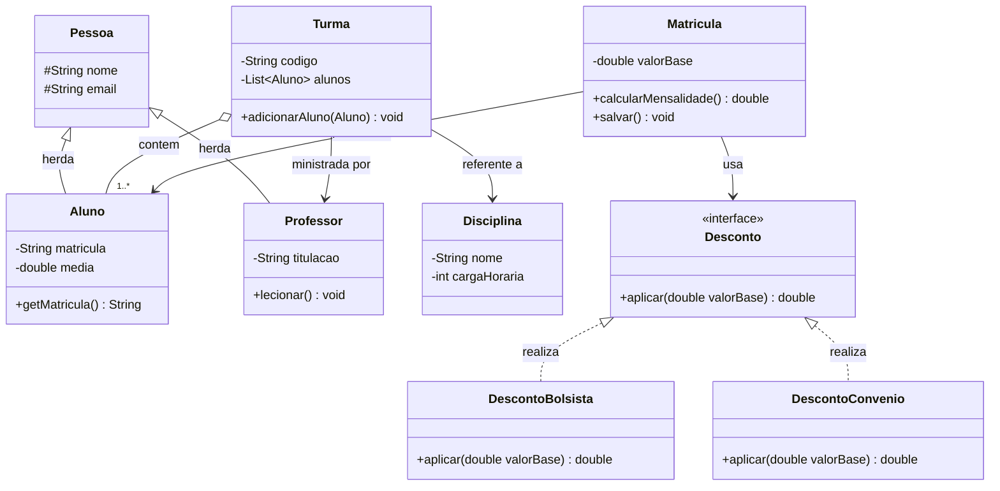
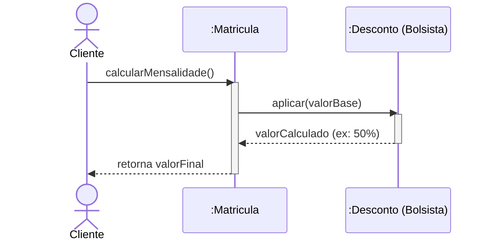

# Atividade Aula 4 - Modelagem UML do SIGA

## 1. Diagrama de Classes (Etapas 1 a 4)

```mermaid
classDiagram
    class Pessoa {
        #String nome
        #String email
    }

    class Aluno {
        -String matricula
        -double media
        +getMatricula() String
    }

    class Professor {
        -String titulacao
        +lecionar() void
    }

    Pessoa <|-- Aluno : herda
    Pessoa <|-- Professor : herda

    class Disciplina {
        -String nome
        -int cargaHoraria
    }

    class Matricula {
        -double valorBase
        +calcularMensalidade() double
        +salvar() void
    }

    class Turma {
        -String codigo
        -List~Aluno~ alunos
        +adicionarAluno(Aluno) void
    }
    Turma o--"1..*" Aluno : contem

    Matricula --> Aluno : pertence a
    Turma --> Disciplina : referente a
    Turma --> Professor : ministrada por

    class Desconto {
        <<interface>>
        +aplicar(double valorBase) double
    }

    class DescontoBolsista {
        +aplicar(double valorBase) double
    }

    class DescontoConvenio {
        +aplicar(double valorBase) double
    }

    Desconto <|.. DescontoBolsista : realiza
    Desconto <|.. DescontoConvenio : realiza
    Matricula --> Desconto : usa
```

---

## 2. Diagrama de Sequência (Etapa 5)

```mermaid
sequenceDiagram
    actor Cliente
    participant M as :Matricula
    participant D as :Desconto (Bolsista)

    Cliente->>M: calcularMensalidade()
    activate M
    M->>D: aplicar(valorBase)
    activate D
    D-->>M: valorCalculado (ex: 50%)
    deactivate D
    M-->>Cliente: retorna valorFinal
    deactivate M
```